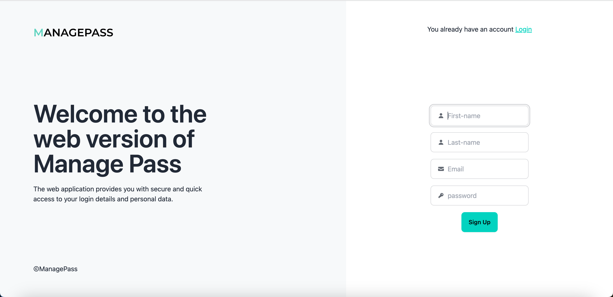

# AngularManagePass

Manage Pass est une application moderne de gestion de mots de passe qui permet aux utilisateurs de gérer facilement et en toute sécurité leurs identifiants pour différents sites web.

This project was generated with [Angular CLI](https://github.com/angular/angular-cli) version 18.2.9.

## Serveur de développement

Exécutez ng serve pour démarrer un serveur de développement. Accédez à http://localhost:4200/. L'application se rechargera automatiquement si vous modifiez l'un des fichiers sources.

## Compilation

Exécutez ng build pour compiler le projet. Les artefacts de compilation seront stockés dans le répertoire dist/.

## Installation

Clonez le dépôt GitHub :

git clone https://github.com/chailafarah/ManagePass.git

cd manage-pass

### Installez les dépendances :

npm install

## Fonctionnalités

Authentification Firebase :

Inscription et connexion via email et mot de passe.

### Gestion des identifiants :

Accédez à une liste de vos sites enregistrés contenant :

Email
URL
Mot de passe
Nom d'utilisateur (username)

### Ajout et modification des identifiants :

- Ajoutez de nouveaux identifiants.
- Modifiez ou supprimez des entrées existantes.
- Gestion sécurisée des données avec Firestore :

- Toutes les données des utilisateurs sont stockées dans une base Firestore sécurisée.

### La possibilité de générer un mot de passe : 

Automatiquement en cliquant sur le bouton Générer.

### Copie rapide des mots de passe :

Copiez vos mots de passe en un clic.

## Configuration Firebase

### Créer un projet Firebase :

- Connectez-vous à Firebase Console.
- Créez un projet et activez les services suivants :
- Authentication : Activez le fournisseur d'authentification par email/mot de passe.
- Firestore Database : Configurez Firestore en mode "Start in test mode" (modifiable en mode sécurisé plus tard).
- Obtenez les configurations Firebase :

  Rendez-vous dans les paramètres de votre projet Firebase.
- Copiez les clés suivantes : apiKey, authDomain, projectId, storageBucket, messagingSenderId, et appId.
- Configurer l’environnement Firebase :
- Créez un fichier environnement.developpement.ts dans le dossier src/environments avec le contenu suivant :

  **
export const environment = {
    firebase: {
        apiKey: "VOTRE_API_KEY",
        authDomain: "VOTRE_AUTH_DOMAIN",
        projectId: "VOTRE_PROJECT_ID",
        storageBucket: "VOTRE_STORAGE_BUCKET",
        messagingSenderId: "VOTRE_MESSAGING_SENDER_ID",
        appId: "VOTRE_APP_ID"
    }
};**

## Utilisation

### Authentification :

Créez un compte ou connectez-vous via email et mot de passe.

### Ajout d'un identifiant :

Ajoutez une entrée avec les champs suivants :

* URL
* Email
* Mot de passe
* Nom d'utilisateur
* Modification/Suppression :

Modifiez ou supprimez des entrées existantes.

### Copie rapide :

Utilisez l'option de copie pour récupérer rapidement un mot de passe.

## Structure de la base de données Firestore

La base de données Firestore est organisée de la manière suivante :

Collection : passwords

Chaque document représente une entrée utilisateur et contient les champs suivants :

uid : Identifiant unique de l'utilisateur.
email : Email associé au compte.
url : URL du site.
password : Mot de passe du site.
username : Nom d'utilisateur associé à l'identifiant.

